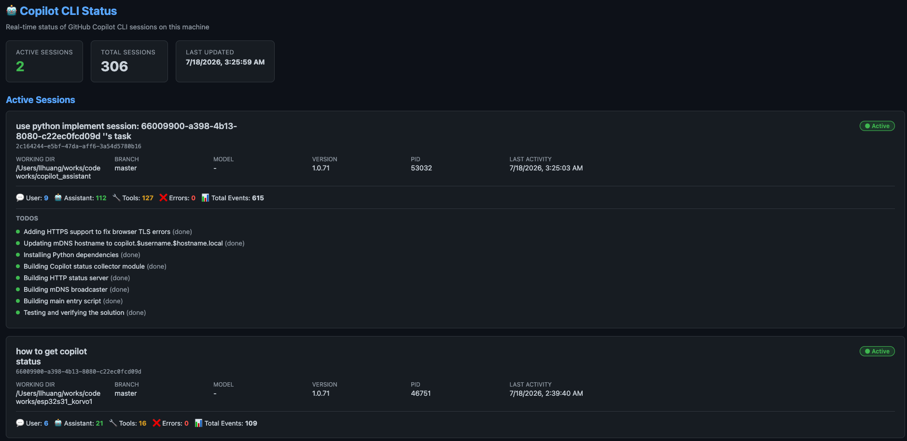

# Copilot CLI Status Monitor

Real-time status monitor for GitHub Copilot CLI sessions, accessible from any device on the local network via mDNS.



## Features

- 📊 **Real-time Dashboard** - Dark-themed HTML dashboard with auto-refresh (5s)
- 📡 **mDNS Broadcast** - Discoverable as `copilot.<username>.<hostname>.local:8585` on the local network (supports macOS & Linux)
- 🔌 **REST API** - JSON endpoints for programmatic access
- 📋 **Session Tracking** - Active sessions, event counts, model info, todos
- 🔍 **Multi-Session** - Monitors all active Copilot CLI sessions simultaneously
- 🌐 **Dual-Stack** - IPv4 + IPv6 for broad device compatibility

## Quick Start

```bash
./start_status.sh
```

Then visit:
- **Local**: http://localhost:8585
- **Network**: http://copilot.\<username\>.\<hostname\>.local:8585 (auto-generated, e.g. `http://copilot.llhuang.hll-mac-air.local:8585`)

> **Note**: Some browsers may auto-attempt HTTPS on `.local` domains, causing 400 errors. If this happens, explicitly type `http://` in the URL.

## Manual Start

```bash
source .venv/bin/activate
python3 -m copilot_status [options]
```

### Options

| Flag | Default | Description |
|------|---------|-------------|
| `-p, --port` | 8585 | HTTP server port |
| `-m, --mdns-host` | auto | mDNS hostname (default: `copilot.<user>.<hostname>`, accessed as `<host>.local`) |
| `--no-mdns` | off | Disable mDNS broadcast |
| `-v, --verbose` | off | Enable debug logging |

## API Endpoints

| Endpoint | Description |
|----------|-------------|
| `GET /` | HTML dashboard |
| `GET /api/status` | Full status (system + active + all sessions) |
| `GET /api/sessions/active` | Active sessions only |
| `GET /api/sessions` | All recent sessions |
| `GET /health` | Health check |

## Architecture

```
copilot_status/
├── __init__.py        # Package init
├── __main__.py        # Entry point (argparse, signal handling, dual-stack)
├── collector.py       # Reads ~/.copilot/session-state/ data
├── server.py          # Flask HTTP server + HTML dashboard
└── mdns.py            # Zeroconf mDNS broadcaster (macOS dns-sd + Linux avahi)
```

### Data Sources

The collector reads from `~/.copilot/session-state/<session-id>/`:
- **workspace.yaml** - Session metadata (cwd, branch, name, etc.)
- **events.jsonl** - Event stream (messages, tool calls, errors)
- **session.db** - SQLite database (todos, inbox entries)
- **inuse.*.lock** - Lock files indicating active sessions

## Requirements

- Python 3.10+
- flask
- zeroconf

Dependencies are auto-installed into a local `.venv` by `start_status.sh`.
